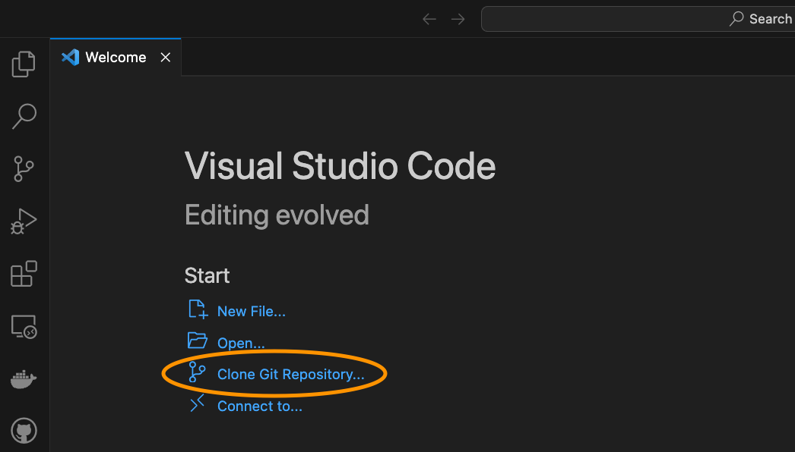
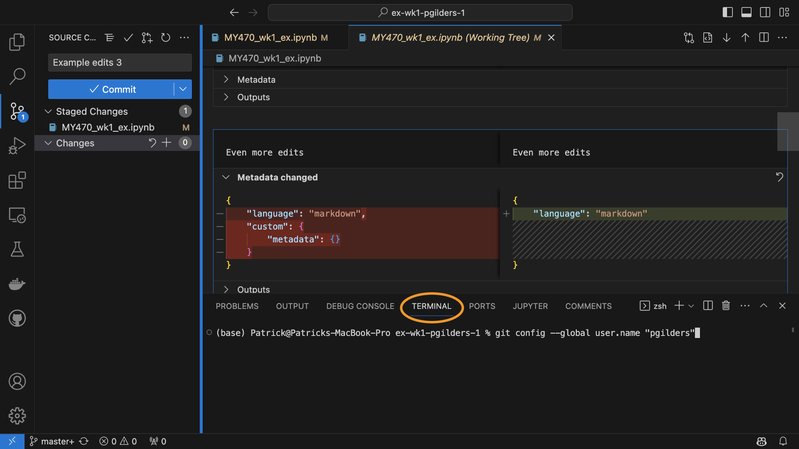

# Git Setup guide

From the VS Code welcome screen, you should be able to see and use the “Clone Git Repository” option. If not, you will need to install Git.

If you get stuck, or anything unexpected arises in this process, please get in touch at p.gildersleve@lse.ac.uk with an explanation of the issue, and we can arrange office hours.

## Installing Git
### Mac
1. Open the “Terminal” application on your Mac.
2. Type into the window `xcode-select –install` and hit return
3. You will be prompted to download and install Xcode command line developer tools, proceed with this.
4. Restart VS Code / your computer.
5. The “Clone Git Repository” option should now appear on the welcome screen.

### Windows
1. Download and run the installer for the right system type [here](https://git-scm.com/download/win) (you will probably need 64-bit, check [here](https://support.microsoft.com/en-us/windows/32-bit-and-64-bit-windows-frequently-asked-questions-c6ca9541-8dce-4d48-0415-94a3faa2e13d) if unsure).
2. Restart VS Code / your computer.
3. The “Clone Git Repository” option should now appear on the welcome screen.

### Linux
1. Follow the instructions [here](https://git-scm.com/download/linux) for your preferred Linux distribuition and package manager. This will probably involve running a command in the terminal e.g. `apt-get install git`.
2. Restart VS Code / your computer.
3. The “Clone Git Repository” option should now appear on the welcome screen.

## Setting global Git username and email

When running through the process of committing and pushing changes to the ex-wk1 repository, you may be faced with a prompt to set your global git credentials/username/email. If so:

1. Select OK/proceed.
2. In the bottom pane that appears, select TERMINAL. (If you can’t see this, select "Terminal" from the "View" option in the top menu bar).
3. Type in: `git config --global user.email "___"` with your email address associated with GitHub inside the quotation marks (instead of the underscores), press return.
4. Type in: `git config --global user.name "___"` with your GitHub username inside the quotation marks (instead of the underscores), press return.
5. You should now be able to proceed with committing and syncing your changes.

